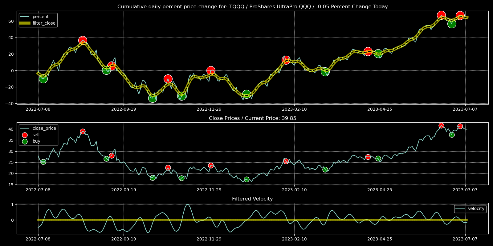

# StockTrendAnalyzer
A Python script that analyzes historical stock market data from Alpaca Markets to detect trends in stock prices. It can identify patterns that indicate buy or sell signals and uses a combination of signal processing and statistical analysis to generate visualizations of the data. This tool is designed to help traders identify potential trading opportunities and make informed investment decisions.

The code was recently updated to classes, methods, and functions for more re-usable and efficient code, so new users can better follow the processing logic.

## Requirements
- Python 3.6 or later
- Alpaca account with API keys
- pandas_market_calendars package
- alpaca_trade_api package
- matplotlib package
- numpy package
- scipy package

The Alpaca API keys should be environment variables, as shown in the config.py file.
## Installation
Clone this repository
Install the required packages: 
<pre>
pip install pandas_market_calendars alpaca_trade_api matplotlib numpy scipy
</pre>
## Usage
<pre>
python StockTrendAnalyzer.py --symbol [symbol] --tail [tail] --window [window] --factor [factor] --plot [plot]
</pre>

## Arguments:
- `--symbol`: the stock symbol (required)
- `--tail`: the tail value, i.e. the number of days to analyze (default: 252)
- `--window`: the window value (default: round(tail // 22.90))
- `--factor`: the factor value (default: 0.20)
- `--plot`: the plot value (default: 1)
## Commands:
- `help`: prints the help message
## Output
The script generates a graph showing the cumulative daily percent price change, close prices, and buy/sell signals for the specified stock symbol.

## Example Usage
To analyze data for stock symbol AAPL for the last 252 days, use the following commands:

<pre>
python StockTrendAnalyzer.py --symbol TSLA
</pre>
or
<pre>
python StockTrendAnalyzer.class.py --symbol TSLA
</pre>

To get help message, use the following command:

<pre>
python StockTrendAnalyzer.py --help
</pre>

## Example Plot Image

## License
This project is licensed under the terms of the Apache V2 License.

## Disclaimer

This project is for educational purposes only and should not be used to make financial decisions. The information provided by this tool is not intended to be relied upon for investment purposes and is not intended to be a substitute for professional financial advice. Trading in the stock market involves substantial risk, and you should always consult with a qualified financial advisor before making any investment decisions. The author of this project disclaims all liability for any direct or indirect damages arising from the use of this tool.
